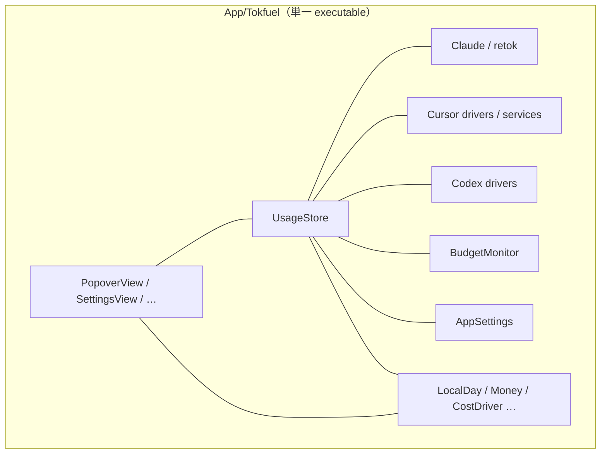
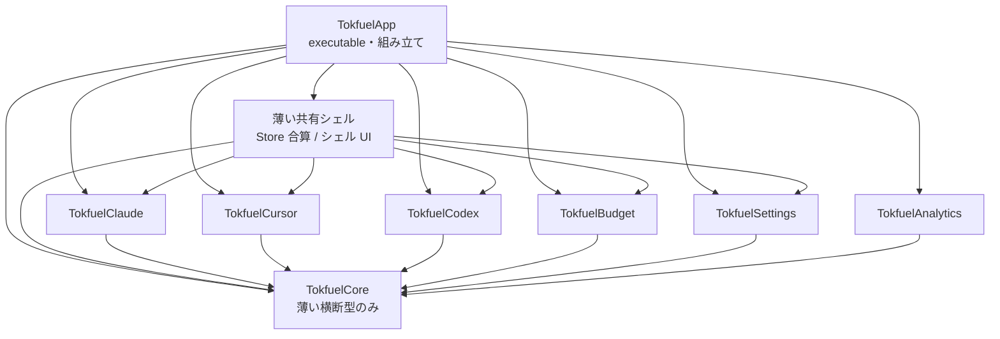
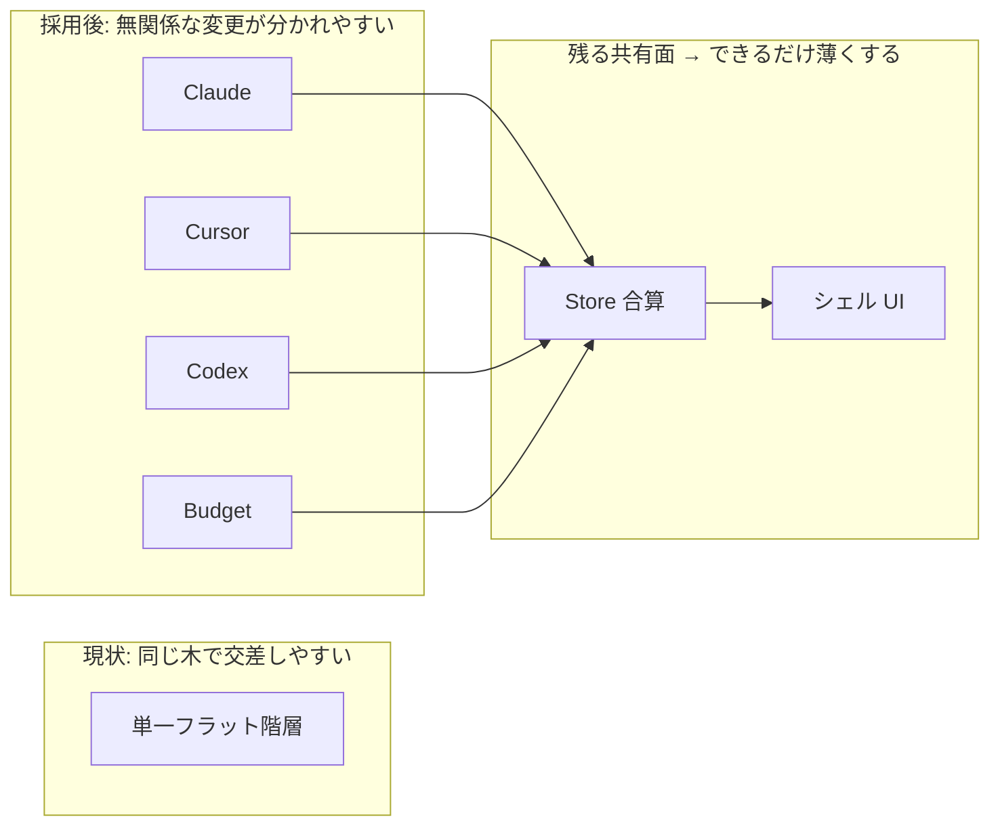

# SPM を feature 縦割りで分割し、並行 PR の衝突面を減らす

[English](./0002-feature-spm-modules.md)

## Decision（決定事項）

> アーキテクチャやソリューションの意思決定の内容

### 決定事項

`App/` 配下の単一 SPM target をやめ、**変更が寄りやすい軸（feature）で library target を縦割り**する。第一の目的は **無関係な Issue / PR 同士の衝突面を減らす**ことである。

- 分割軸の例: Claude / Cursor / Codex / Budget / Settings。横断型だけ薄い `TokfuelCore`（名称は実装時に確定）に置く
- 合算（Store）とシェル UI は共有面として残るが、**可能な限り feature 側へ寄せる**（ソース固有の表示・集計は feature target に置き、共有面は配線と薄い合算に留める）
- Firebase・retok リソース・sqlite3 は、使う feature / Analytics target に閉じる
- **レイヤー依存（UI → Store → drivers など）は SPM の target 境界では強制しない**。AGENTS.md と AI コーディング（スキル・レビュー）で担保する
- 挙動とグラウンドルール（ローカルオンリー、ゼロセットアップ、retok 無改変、python3 任意、新規パッケージ禁止）は変えない

配置の親は ADR-0001 のとおり `App/` のままとする。本決定は **target / モジュール境界** の話であり、ディレクトリ親の再配置ではない。

### 構成図

現状（単一 target・フラット。衝突面が大きい）:

採用する feature 縦割り（矢印は App からの組み立て。レイヤーは規約）:

衝突面の狙い（第一目的）:

名称（`Tokfuel*`）は実装時に確定してよい。図の意図は「feature を縦に割って衝突を減らし、共有シェルは薄く保つ」こと。レイヤーの正しさは図の target 線では表さない。

### 比較・検討内容の要約

第一評価軸を **並行 PR の衝突低減** とする。レイヤー境界は AI コーディングと AGENTS で担保できるため、SPM でレイヤーまで切るハイブリッドの追加コストに見合わない。レイヤーのみは衝突面が Store / UI に集まりやすい。feature 縦割りを採用し、共有シェルは意識して薄くする。極細多数レイヤーはこの規模では過大。

## Context（経緯・背景情報）

> この意思決定が行われる背景、問題点、目的など

### 背景

アプリ本体は `App/Tokfuel/` にフラットに置かれ、`Package.swift` は単一の executable target である（ADR-0001 で親を `App/` に揃えたあとも、target は一つ）。UI・Store・外部通信・コスト計算が同一ディレクトリ・同一 target に混在している（#109）。

OSS として複数の Issue / PR が並ぶと、無関係な変更が同じ巨大ファイルや同じ階層でぶつかりやすい。コントリビュータにも「この変更はどの箱か」が見えにくい。一方、Store / UI / driver の役割分担は AGENTS.md に既にあり、AI セッションでもその規約を読ませて守らせられる。

### 課題

1. **並行 PR の衝突面が大きい**（第一）
   - フラットな単一 target だと、Cursor 修正と予算修正のような無関係な作業も同じ木で交差しやすい。
2. **変更範囲が切りにくい**
   - 新機能やソース追加のとき、触るべきファイル集合がディレクトリ名から読み取りにくい。
3. **共有シェルが太いままだと、feature 分割の効果が削がれる**
   - 合算と画面に変更が集まり続けると、縦割りの利点が薄れる。
4. **レイヤー違反は起きうるが、主目的ではない**
   - 規約だけの境界は残る。ただし本決定ではそれを SPM で買い直さない。

### 目的

- 無関係な Issue 同士の衝突面を小さくする（第一）
- コントリビュータが変更範囲を切りやすくする
- 共有シェル（Store / シェル UI）を薄くし、feature 側へ寄せる
- レイヤーは AGENTS + AI コーディングで維持する
- `swift test` / `swift build -c release` を各段階で緑に保つ

## Consideration（比較・検討内容）

> 他に検討した選択肢や検討した内容

### 比較対象

| 案 | ソリューション | 概要 |
|----|----------------|------|
| 案1 | **現状維持** | 単一 target・フラット配置のまま |
| 案2 | **レイヤーのみ** | UI / Store / Services / Core などに割る。feature は分けない |
| 案3 | **feature 縦割り** | Claude / Cursor / Codex / Budget などに割る。レイヤーは規約 + AI |
| 案4 | **極細レイヤー多数** | feature 内まで Interface / Data 等を細かく target 化 |
| 案5 | **ハイブリッド** | feature 縦割り + レイヤー依存を SPM でも強制 |

### 比較表

第一評価軸は「並行 PR の衝突低減」。

| 評価項目 | 案1 現状維持 | 案2 レイヤーのみ | 案3 feature 縦割り | 案4 極細多数 | 案5 ハイブリッド |
|----------|--------------|------------------|--------------------|--------------|------------------|
| 並行 PR の衝突低減（第一） | × ホットスポットが大きい | △ Store / UI に集まりやすい | ◎ 無関係 Issue が分かれやすい | ○ 分かれるが運用が重い | ◎ 案3と同程度。共有シェルは同様に残る |
| 変更範囲の切りやすさ | × 入口が一つ | △ 「何層か」は分かるが機能軸が弱い | ◎ 「どのソースか」で切れる | △ target 数が多すぎる | ◎ 機能軸は同じ。層の箱が増える |
| レイヤー担保 | △ 規約 + AI | ◎ コンパイルで向きを固定 | △ 規約 + AI（本リポでは十分とみなす） | ◎ さらに細かい | ◎ SPM でも固定できるが第一目的には過剰 |
| 移行コスト | ◎ 変更不要 | ○ 中程度 | ○ 中程度 | × この規模では過大 | △ 案3より重い（層 target の追加分） |
| Tokfuel / AI 開発との適合 | △ 衝突が残る | △ 衝突対策が弱い | ◎ 衝突第一。層は AI で補う | × SDK / 巨大アプリ向け | △ 層の強制は欲しいがコストが勝つ |

### 総合評価

| 案 | 総合評価 | 判定 |
|----|----------|------|
| 案1: 現状維持 | 衝突面の課題が残る | **不採用** |
| 案2: レイヤーのみ | 衝突という第一目的に弱い | **不採用** |
| 案3: feature 縦割り | 衝突低減に最も効く。層は AI / 規約で足りる | **採用** |
| 案4: 極細多数 | きれいさに対して移行・運用コストが過大 | **不採用** |
| 案5: ハイブリッド | 層の強制は得られるが、衝突面では案3と大差なく追加コストが大きい | **不採用** |

## Consequences（結果）

> 予期される結果。意思決定がシステムやプロジェクトに与える影響

### 期待される効果

1. Cursor 修正と Budget 修正のような無関係な PR が、別 target / ディレクトリに分かれやすくなる
2. 「この Issue は `TokfuelCursor` を見ればよい」のように、変更範囲を説明しやすくなる
3. ソース固有 UI / 集計を feature に寄せるほど、共有シェル上の衝突も減らせる

### 技術的リスクと対策

| リスク | 内容 | 対策 |
|--------|------|------|
| Store / シェル UI のホットスポット | 合算と画面は共有のまま残りやすい | ソース固有の表示・集計を feature へ移す。共有面は配線と薄い合算に限定する |
| レイヤー逆流 | SPM では止めないため、UI が driver を直接見ることがありうる | AGENTS.md を維持。AI 実装・レビューで検知。悪用が増えたら別 ADR で層 target を検討する |
| target 数の増加 | `Package.swift` と import が重くなる | Core を薄く保つ。極細レイヤー（案4）やハイブリッド（案5）にはしない |
| 逆依存の残留 | `BudgetMonitor`→UI、`AppSettings`→driver などが分割を阻む | target を切る前に callback / プロトコル化でほどく |
| リソース移設 | retok の `Bundle.module` や Firebase plist の場所がずれる | Claude / Analytics 側へ移し、`swift test` と実機相当で確認 |
| 移行の巨大化 | 一気にやるとレビューが重い | Core → Settings → sources → 共有シェル薄化 → App の順。必要なら PR を段階分割する |

## References（参照）

> 関連リンク

- Issue: [#109](https://github.com/Tokfuel/Tokfuel/issues/109)
- PR: https://github.com/Tokfuel/Tokfuel/pull/148
- 関連 ADR: [0001-app-tree](../0001-app-tree/0001-app-tree.ja.md)（`App/` への集約。本決定の前提）
- 外部: （なし）
