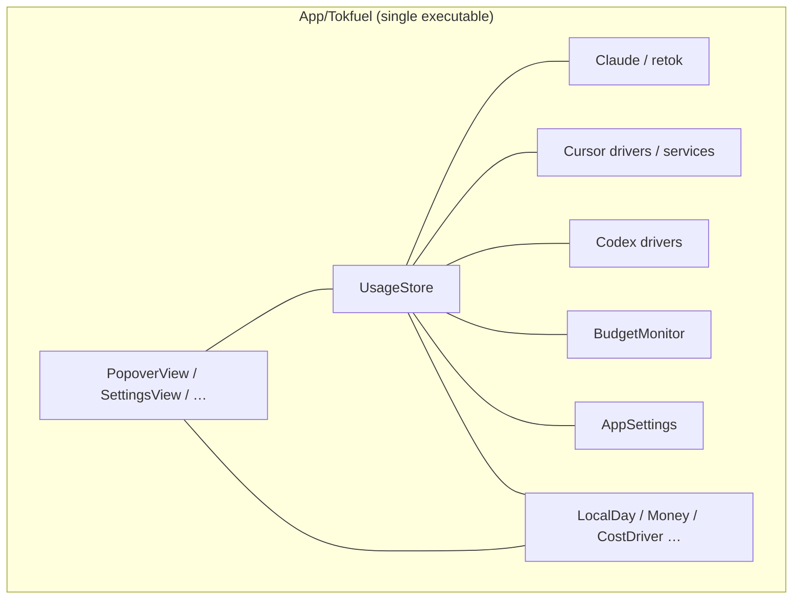
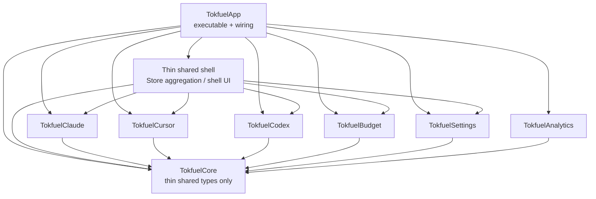
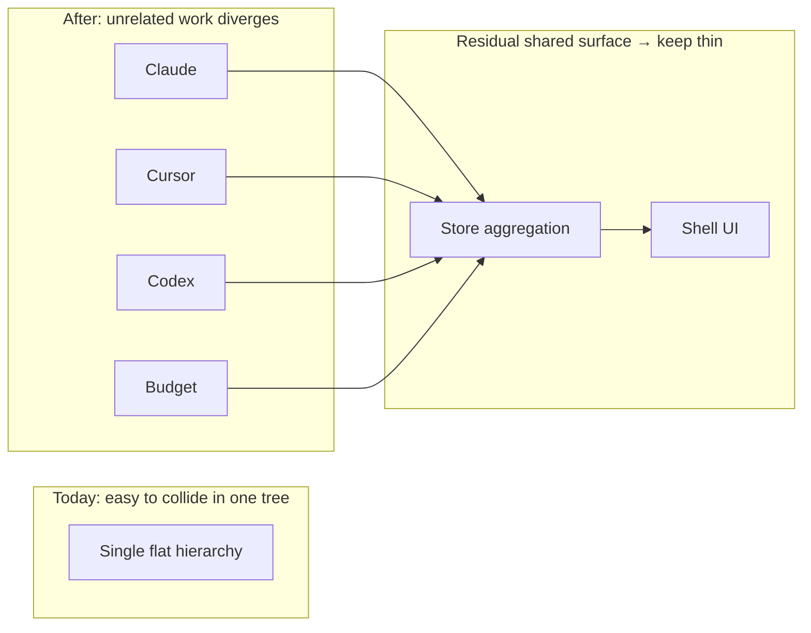

# Split SPM targets by feature to shrink parallel-PR collisions

[日本語](./0002-feature-spm-modules.ja.md)

## Decision

> What was decided about the architecture or solution

### Decision

Stop using a single SPM target under `App/`. Split library targets **vertically by feature** (axes where changes cluster). The primary goal is to **shrink the merge-conflict surface between unrelated Issues / PRs**.

- Example axes: Claude / Cursor / Codex / Budget / Settings. Put only truly shared types in a thin `TokfuelCore` (exact names fixed at implementation time)
- Aggregation (Store) and shell UI remain shared, but **push as much as possible into feature targets** (source-specific UI and totals live with the feature; the shared shell stays wiring plus thin aggregation)
- Keep Firebase, retok resources, and sqlite3 inside the targets that use them
- **Do not buy compile-time layer edges (UI → Store → drivers) in this decision.** With aggregation and shell UI remaining as shared surfaces, the same SPM shape could not both maximize feature-split collision reduction and enforce layers via targets. Keep layer direction via AGENTS.md and AI coding (skills / review)
- Do not change product behavior or the ground rules (local-only data, zero setup, unmodified retok, optional python3, no new packages)

The parent layout stays under `App/` per ADR-0001. This decision is about **target / module boundaries**, not about rehoming the top-level tree again.

### Diagrams

Today (single target, flat tree; large conflict surface):

Adopted feature split (arrows are App wiring; layers stay convention):

Conflict surface (primary goal):

`Tokfuel*` names may be finalized at implementation time. The diagrams mean: split by feature to cut collisions, and keep the shared shell thin. Layer correctness is not drawn as SPM edges.

### Summary of alternatives

Trying to get both collision reduction (feature splits) and dependency enforcement (layer targets) in one architecture still leaves aggregation and shell UI shared, so a hybrid does not deliver both. Because they could not be reconciled, **prefer parallel-PR collision reduction and leave layers to convention + AI**. Layers-only still funnels work into Store / UI. Extreme fine layering is too heavy at this size.

## Context

> Background, problem, and goal for this decision

### Background

App code still lives flat under `App/Tokfuel/` with a single executable target in `Package.swift` (ADR-0001 only aligned the parent under `App/`). UI, store, networking, and cost logic share one directory and one target (#109).

As an OSS repo with concurrent Issues / PRs, unrelated work collides in the same large files and the same tree. Contributors also lack a clear “which box do I touch?” signal. Store / UI / driver roles are already written in AGENTS.md and can be enforced in AI sessions that read those rules.

### Problems

1. **Large merge conflict surface** (primary)
   - A single flat target makes unrelated work (for example Cursor vs budget) intersect in the same tree.
2. **Hard to scope a change**
   - The set of files for a feature or source is not obvious from directory names.
3. **A fat shared shell undercuts feature splits**
   - If aggregation and screens keep collecting every change, vertical splits help less.
4. **Collision reduction and layer enforcement cannot both be satisfied in one SPM shape**
   - Aggregation and shell UI remain product-level shared surfaces. Adding layer targets there does not cut unrelated-PR overlap beyond a feature split.

### Goals

- Shrink conflict surface between unrelated Issues (the side we take of the two irreconcilable goals)
- Make change scope easier to explain to contributors
- Thin the shared shell (Store / shell UI) and push work into features
- Cover the side we did not take (layer enforcement) with AGENTS + AI coding
- Keep `swift test` / `swift build -c release` green at each step

## Consideration

> Alternatives that were considered

### Options

| Option | Solution | Overview |
|--------|----------|----------|
| 1 | **Status quo** | Keep one target and a flat tree |
| 2 | **Layers only** | Split UI / Store / Services / Core; do not split by feature |
| 3 | **Feature vertical split** | Split Claude / Cursor / Codex / Budget; layers via convention + AI |
| 4 | **Many fine layers** | Split Interface / Data (and more) inside each feature |
| 5 | **Hybrid** | Feature targets + SPM-enforced layer edges |

### Comparison

Primary criterion: reduce parallel-PR collisions.

| Criterion | 1 Status quo | 2 Layers only | 3 Feature split | 4 Fine layers | 5 Hybrid |
|-----------|--------------|---------------|-----------------|---------------|----------|
| Reduce parallel-PR collisions (primary) | × Large hotspots | △ Work still piles into Store / UI | ◎ Unrelated Issues diverge | ○ Diverges but heavy to run | ◎ Same order as 3; shared shell remains |
| Scope a change | × One entry point | △ Layers clear; feature axis weak | ◎ “Which source?” is clear | △ Too many targets | ◎ Same feature axis; more layer boxes |
| Layer guarantees | △ Docs + AI | ◎ Compile-time direction | △ Docs + AI (covers the side we did not take) | ◎ Even finer | ◎ Layers can be enforced, but shared-surface collisions stay like 3 |
| Migration cost | ◎ No change | ○ Medium | ○ Medium | × Too large here | △ Heavier than 3 (extra layer targets) |
| Reconcile both goals | × Weak on both | × Weak on collisions | ○ Take collisions; leave layers outside SPM | × Too heavy | × Aims at both; shared surface prevents true reconciliation |

### Overall

| Option | Assessment | Verdict |
|--------|------------|---------|
| 1: Status quo | Collision surface remains | **Rejected** |
| 2: Layers only | Does not reconcile with collision reduction | **Rejected** |
| 3: Feature vertical split | Of the two irreconcilable goals, take collisions; layers via docs + AI | **Accepted** |
| 4: Fine layers | Cleanliness does not justify cost | **Rejected** |
| 5: Hybrid | Tries to take both; shared surface means they are not reconciled | **Rejected** |

## Consequences

> Expected effects on the system and project

### Expected benefits

1. Unrelated PRs (for example Cursor vs Budget) are more likely to touch different targets / directories
2. Change scope is easier to explain (“look at `TokfuelCursor`”)
3. Pushing source-specific UI / totals into features also shrinks collisions on the shared shell

### Risks and mitigations

| Risk | Detail | Mitigation |
|------|--------|------------|
| Store / shell UI hotspots | Aggregation and screens can still collide | Move source-specific UI and totals into features; keep the shell as wiring plus thin aggregation |
| Layer leaks | The side we could not take in SPM; UI may still see drivers | Keep AGENTS.md; catch in AI implementation / review; after thinning the shared shell, open another ADR for layer targets if still needed |
| More targets | Heavier `Package.swift` and imports | Keep Core thin; do not adopt options 4 or 5 |
| Remaining inverted deps | For example BudgetMonitor → UI, AppSettings → drivers | Untangle with callbacks / protocols before cutting targets |
| Resource moves | `Bundle.module` for retok or Firebase plist can break | Move with Claude / Analytics targets; verify with `swift test` and runtime checks |
| Huge migration | One big change is hard to review | Order: Core → Settings → sources → thin shared shell → App; split PRs if needed |

## References

> Related links

- Issue: [#109](https://github.com/Tokfuel/Tokfuel/issues/109)
- PR: https://github.com/Tokfuel/Tokfuel/pull/148
- Related ADR: [0001-app-tree](../0001-app-tree/0001-app-tree.md) (`App/` layout; prerequisite)
- External: (none)
