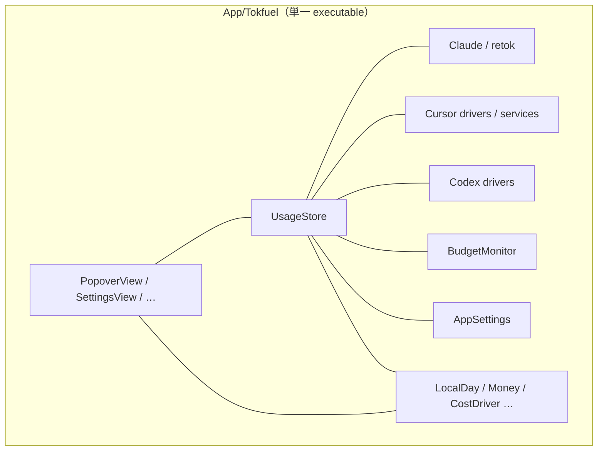
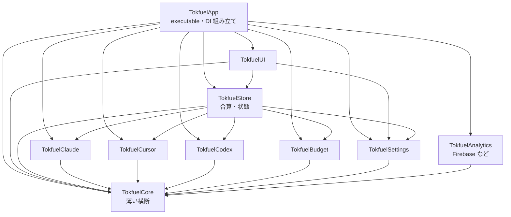
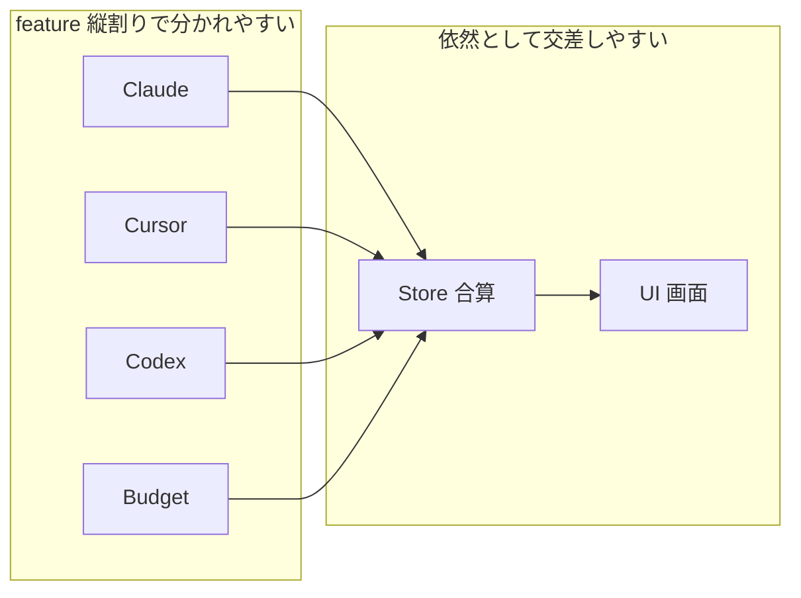

# SPM を feature 縦割りとレイヤー規則のハイブリッドに分割する

[English](./0002-hybrid-spm-modules.md)

## Decision（決定事項）

> アーキテクチャやソリューションの意思決定の内容

### 決定事項

`App/` 配下の単一 SPM target をやめ、**feature 縦割り**と**レイヤー依存規則**を組み合わせたハイブリッド分割を採用する。

- 変更が寄りやすい軸（Claude / Cursor / Codex / Budget / Settings / UI など）を別 library target に割る
- 依存の向きはレイヤー規則で固定する（例: UI → Store → drivers。具象 driver は App が DI する）
- 横断物（日付、Money、`CostDriver` プロトコルなど）は薄い `TokfuelCore`（名称は実装時に確定）に置く
- Firebase・retok リソース・sqlite3 は、使う feature / Analytics target に閉じる
- 挙動とグラウンドルール（ローカルオンリー、ゼロセットアップ、retok 無改変、python3 任意、新規パッケージ禁止）は変えない

配置の親は ADR-0001 のとおり `App/` のままとする。本決定は **target / モジュール境界** の話であり、ディレクトリ親の再配置ではない。

### 構成図

現状（単一 target・フラット）:

採用するハイブリッド（依存は上から下のみ。矢印は import 方向）:

衝突面のイメージ（灰色が共有ホットスポット）:

名称（`Tokfuel*`）は実装時に確定してよい。図の意図は「feature を縦に割り、依存の向きをレイヤーで固定する」こと。

### 比較・検討内容の要約

現状維持では規約だけで Store / UI の境界を守れず、無関係な PR も同じフラット階層で衝突しやすい。レイヤーのみは依存方向はきれいだがホットスポットが残る。feature のみは衝突は減るが逆流を止めにくい。ハイブリッドなら両方に効くため採用する。極細の多数レイヤー（インフラライブラリ型）はこの規模では移行コストに見合わない。

## Context（経緯・背景情報）

> この意思決定が行われる背景、問題点、目的など

### 背景

アプリ本体は `App/Tokfuel/` にフラットに置かれ、`Package.swift` は単一の executable target である（ADR-0001 で親を `App/` に揃えたあとも、target は一つ）。UI・Store・外部通信・コスト計算が同一ディレクトリ・同一 target に混在している。AGENTS.md には「`UsageStore` を唯一の情報源に保ち、`PopoverView` は純粋な表示層のまま」とあるが、構造で強制する仕組みはない（#109）。

OSS として複数の Issue / PR が並ぶと、無関係な変更が同じ巨大ファイルや同じ階層でぶつかりやすい。コントリビュータにも「この変更はどの箱か」が見えにくい。

### 課題

1. **規約だけの境界**
   - Store / UI / driver の役割分担が文書依存で、コンパイルでは守れない。
2. **並行 PR の衝突面が大きい**
   - フラットな単一 target だと、Cursor 修正と予算修正のような無関係な作業も同じ木で交差しやすい。
3. **変更範囲が切りにくい**
   - 新機能やソース追加のとき、触るべきファイル集合がディレクトリ名から読み取りにくい。
4. **後続の規模拡大に備える必要がある**
   - 通貨・表示・ソース追加を重ねるほど、密結合の影響範囲が広がる。

### 目的

- 依存の逆流を構造で止める
- 無関係な Issue 同士の衝突面を小さくする
- コントリビュータが変更範囲を切りやすくする
- `swift test` / `swift build -c release` を各段階で緑に保つ

## Consideration（比較・検討内容）

> 他に検討した選択肢や検討した内容

### 比較対象

| 案 | ソリューション | 概要 |
|----|----------------|------|
| 案1 | **現状維持** | 単一 target・フラット配置のまま。境界は AGENTS の規約のみ |
| 案2 | **レイヤーのみ** | UI / Store / Services / Core などに割る。feature は分けない |
| 案3 | **feature のみ** | Claude / Cursor / Codex / Budget などに割る。レイヤー規則は持たない |
| 案4 | **極細レイヤー多数** | feature 内まで Interface / Data 等を細かく target 化（大規模アプリ・SDK 型） |
| 案5 | **ハイブリッド** | feature 縦割り + レイヤー依存規則（UI → Store → drivers、薄い Core） |

### 比較表

| 評価項目 | 案1 現状維持 | 案2 レイヤーのみ | 案3 feature のみ | 案4 極細多数 | 案5 ハイブリッド |
|----------|--------------|------------------|------------------|--------------|------------------|
| 依存方向の強制 | × 規約のみ | ◎ 向きを固定できる | △ feature 内でまた混ざる | ◎ さらに細かい | ◎ 向きを固定できる |
| 並行 PR の衝突低減 | × ホットスポットが大きい | △ Store / UI に集まりやすい | ◎ 無関係 Issue が分かれやすい | ○ 分かれるが運用が重い | ◎ feature で分かれ、横断は薄く保つ |
| 変更範囲の切りやすさ | × 入口が一つ | △ 「何層か」は分かるが機能軸が弱い | ◎ 「どのソースか」で切れる | △ target 数が多すぎる | ◎ 機能軸 + 層の両方 |
| 移行コスト | ◎ 変更不要 | ○ 中程度 | ○ 中程度 | × この規模では過大 | △ 案2/3より重いが一気にやる前提で許容 |
| Tokfuel 規模との適合 | △ 当面は動くが伸びない | ○ 小規模向け | ○ OSS 並行向け | × SDK / 巨大アプリ向け | ◎ 現状の課題に合う |

### 総合評価

| 案 | 総合評価 | 判定 |
|----|----------|------|
| 案1: 現状維持 | 規約だけの境界と衝突面の課題が残る | **不採用** |
| 案2: レイヤーのみ | 依存はきれいだが OSS の並行 PR 対策が弱い | **不採用** |
| 案3: feature のみ | 衝突は減るが逆流を止めにくい | **不採用** |
| 案4: 極細多数 | きれいさに対して移行・運用コストが過大 | **不採用** |
| 案5: ハイブリッド | 衝突面と依存強制の両方に効く | **採用** |

## Consequences（結果）

> 予期される結果。意思決定がシステムやプロジェクトに与える影響

### 期待される効果

1. Cursor 修正と Budget 修正のような無関係な PR が、別 target / ディレクトリに分かれやすくなる
2. UI が SQLite や retok 実装を直接見ない、といった逆流をコンパイルで検知できる
3. 「この Issue は `TokfuelCursor` を見ればよい」のように、変更範囲を説明しやすくなる

### 技術的リスクと対策

| リスク | 内容 | 対策 |
|--------|------|------|
| target 数の増加 | `Package.swift` と import が重くなる | Core を薄く保つ。極細レイヤー（案4）にはしない |
| Store / UI のホットスポット | 合算と画面は依然として衝突しやすい | PR を小さく保つ。presentation の切り出しを移行中に進める |
| 逆依存の残留 | `BudgetMonitor`→UI、`AppSettings`→driver などが分割を阻む | target を切る前に callback / プロトコル化でほどく |
| リソース移設 | retok の `Bundle.module` や Firebase plist の場所がずれる | Claude / Analytics 側へ移し、`swift test` と実機相当で確認 |
| 移行の巨大化 | 一気にやるとレビューが重い | コミット順は Core → Settings → sources → 逆依存解消 → Store → UI → App を守る。必要なら PR を段階分割する |

## References（参照）

> 関連リンク

- Issue: [#109](https://github.com/Tokfuel/Tokfuel/issues/109)
- PR: https://github.com/Tokfuel/Tokfuel/pull/148
- 関連 ADR: [0001-app-tree](../0001-app-tree/0001-app-tree.ja.md)（`App/` への集約。本決定の前提）
- 外部: （なし）
