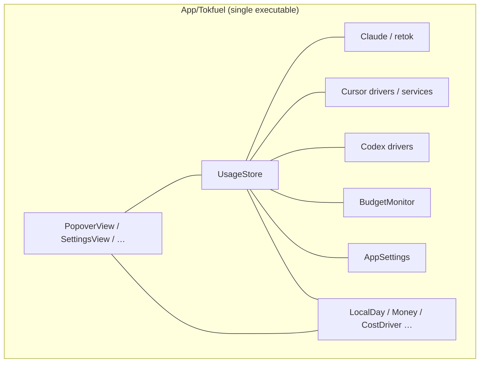
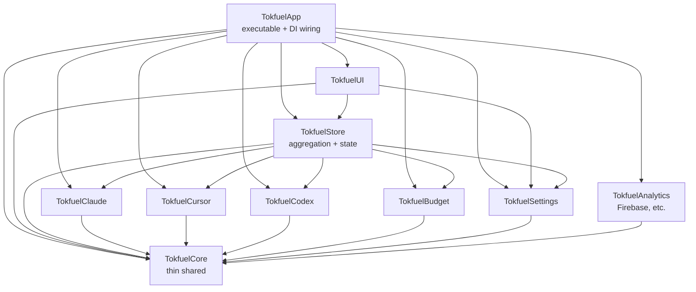
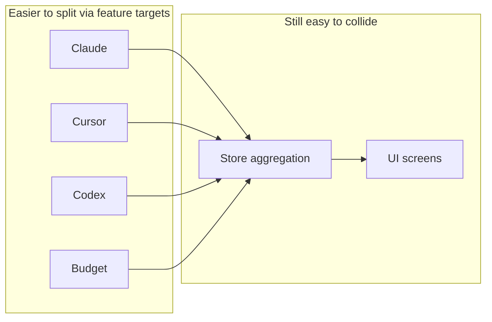

# Split SPM targets by feature with layer dependency rules

[日本語](./0002-hybrid-spm-modules.ja.md)

## Decision

> What was decided about the architecture or solution

### Decision

Stop using a single SPM target under `App/`. Adopt a **hybrid** split: **feature-oriented targets** plus **layer dependency rules**.

- Split library targets along axes where changes cluster (Claude / Cursor / Codex / Budget / Settings / UI, and similar)
- Enforce dependency direction by layer (for example UI → Store → drivers; concrete drivers are injected by the App target)
- Keep cross-cutting types (dates, Money, the `CostDriver` protocol, and similar) in a thin shared core (exact target names are fixed at implementation time)
- Keep Firebase, retok resources, and sqlite3 inside the targets that use them
- Do not change product behavior or the ground rules (local-only data, zero setup, unmodified retok, optional python3, no new packages)

The parent layout stays under `App/` per ADR-0001. This decision is about **target / module boundaries**, not about rehoming the top-level tree again.

### Diagrams

Today (single target, flat tree):

Adopted hybrid (dependencies flow downward only; arrows are import direction):

Conflict surface (shared hotspots remain):

`Tokfuel*` names may be finalized at implementation time. The diagrams mean: split vertically by feature, and fix dependency direction by layer.

### Summary of alternatives

Status quo cannot enforce Store / UI boundaries and keeps unrelated PRs colliding in one flat tree. Layers-only cleans dependency direction but leaves hotspots. Features-only reduces collisions but cannot stop upward leaks. A hybrid addresses both. Extreme fine-grained layering (SDK / huge-app style) costs too much at this size.

## Context

> Background, problem, and goal for this decision

### Background

App code still lives flat under `App/Tokfuel/` with a single executable target in `Package.swift` (ADR-0001 only aligned the parent under `App/`). UI, store, networking, and cost logic share one directory and one target. AGENTS.md says `UsageStore` is the source of truth and `PopoverView` stays presentational, but nothing in the build enforces that (#109).

As an OSS repo with concurrent Issues / PRs, unrelated work tends to collide in the same large files and the same tree. Contributors also lack a clear “which box do I touch?” signal.

### Problems

1. **Boundaries by convention only**
   - Store / UI / driver roles depend on docs, not the compiler.
2. **Large merge conflict surface**
   - A single flat target makes unrelated work (for example Cursor vs budget) intersect in the same tree.
3. **Hard to scope a change**
   - The set of files for a feature or source is not obvious from directory names.
4. **Need room to grow**
   - Currency, display, and new sources widen the blast radius while coupling stays high.

### Goals

- Stop dependency inversion structurally
- Shrink conflict surface between unrelated Issues
- Make change scope easier to explain to contributors
- Keep `swift test` / `swift build -c release` green at each step

## Consideration

> Alternatives that were considered

### Options

| Option | Solution | Overview |
|--------|----------|----------|
| 1 | **Status quo** | Keep one target and a flat tree; boundaries stay in AGENTS only |
| 2 | **Layers only** | Split UI / Store / Services / Core; do not split by feature |
| 3 | **Features only** | Split Claude / Cursor / Codex / Budget; no layer rules |
| 4 | **Many fine layers** | Split Interface / Data (and more) inside each feature (SDK / large-app style) |
| 5 | **Hybrid** | Feature targets + layer dependency rules (UI → Store → drivers, thin Core) |

### Comparison

| Criterion | 1 Status quo | 2 Layers only | 3 Features only | 4 Fine layers | 5 Hybrid |
|-----------|--------------|---------------|-----------------|---------------|----------|
| Enforce dependency direction | × Docs only | ◎ Direction is fixed | △ Features can still mix layers | ◎ Even finer | ◎ Direction is fixed |
| Reduce parallel-PR collisions | × Large hotspots | △ Work still piles into Store / UI | ◎ Unrelated Issues diverge | ○ Diverges but heavy to run | ◎ Features diverge; shared core stays thin |
| Scope a change | × One entry point | △ Layers are clear; feature axis is weak | ◎ “Which source?” is clear | △ Too many targets | ◎ Feature axis plus layers |
| Migration cost | ◎ No change | ○ Medium | ○ Medium | × Too large here | △ Heavier than 2/3; acceptable if done deliberately |
| Fit for Tokfuel’s size | △ Works for now; does not scale | ○ Fine for small apps | ○ Good for OSS concurrency | × Aimed at SDKs / huge apps | ◎ Matches current pain |

### Overall

| Option | Assessment | Verdict |
|--------|------------|---------|
| 1: Status quo | Convention-only boundaries and collision surface remain | **Rejected** |
| 2: Layers only | Clean deps; weak help for concurrent OSS PRs | **Rejected** |
| 3: Features only | Fewer collisions; weak stop for upward leaks | **Rejected** |
| 4: Fine layers | Cleanliness does not justify cost at this size | **Rejected** |
| 5: Hybrid | Helps both collisions and dependency enforcement | **Accepted** |

## Consequences

> Expected effects on the system and project

### Expected benefits

1. Unrelated PRs (for example Cursor vs Budget) are more likely to touch different targets / directories
2. Illegal edges (UI talking to SQLite or retok internals) fail at compile time
3. Change scope is easier to explain (“look at `TokfuelCursor`”)

### Risks and mitigations

| Risk | Detail | Mitigation |
|------|--------|------------|
| More targets | Heavier `Package.swift` and imports | Keep Core thin; do not adopt option 4 |
| Store / UI hotspots | Aggregation and UI can still collide | Keep those PRs small; extract presentation during the move |
| Remaining inverted deps | For example BudgetMonitor → UI, AppSettings → drivers | Untangle with callbacks / protocols before cutting targets |
| Resource moves | `Bundle.module` for retok or Firebase plist can break | Move with Claude / Analytics targets; verify with `swift test` and runtime checks |
| Huge migration | One big change is hard to review | Keep commit order Core → Settings → sources → untangle → Store → UI → App; split PRs if needed |

## References

> Related links

- Issue: [#109](https://github.com/Tokfuel/Tokfuel/issues/109)
- PR: https://github.com/Tokfuel/Tokfuel/pull/148
- Related ADR: [0001-app-tree](../0001-app-tree/0001-app-tree.md) (`App/` layout; prerequisite)
- External: (none)
