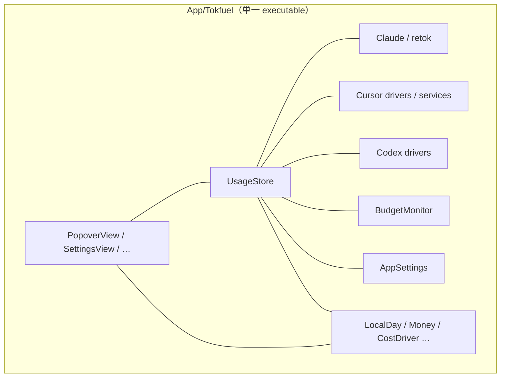
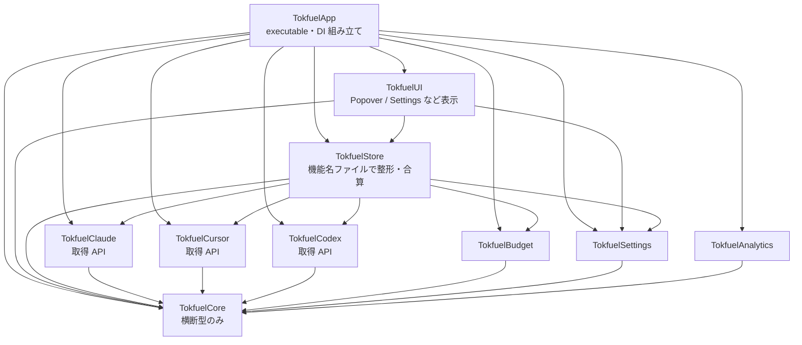
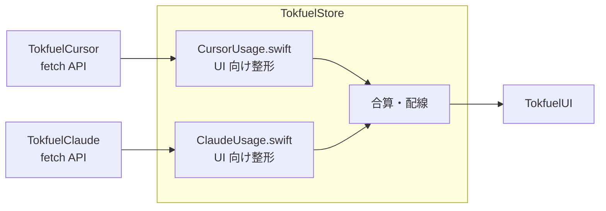

# SPM を UI / Store / sources のレイヤーで分割する

[English](./0002-layer-spm-modules.md)

## Decision（決定事項）

> アーキテクチャやソリューションの意思決定の内容

### 決定事項

`App/` 配下の単一 SPM target をやめ、**レイヤーで library target を分割**する。データの流れは次で固定する。

```text
sources（Claude / Cursor / Codex / …）  … 取得ロジック。情報を取る API を公開する
        ↓
Store                                   … 機能名ファイルごとに UI 向けへ整形・合算する
        ↓
UI                                      … Store が渡す情報を表示する
```

- 依存の向きは **UI → Store → sources**。具象の組み立ては App（executable）が行う
- sources は取得軸で分ける（例: Claude / Cursor / Codex / Budget）。横断型だけ薄い `TokfuelCore`（名称は実装時に確定）に置く
- Store はソース固有の整形を **機能名ファイル**（例: `CursorUsage.swift` / `ClaudeUsage.swift`）に分け、UI へ渡す形にまとめる
- UI は Store（と表示に必要な薄い型）だけを見る。SQLite・retok・ダッシュボード API などを直接見ない
- Firebase・retok リソース・sqlite3 は、使う source / Analytics target に閉じる
- 挙動とグラウンドルール（ローカルオンリー、ゼロセットアップ、retok 無改変、python3 任意、新規パッケージ禁止）は変えない

配置の親は ADR-0001 のとおり `App/` のままとする。本決定は **target / モジュール境界** の話であり、ディレクトリ親の再配置ではない。

feature 縦割り（UI 片まで各ソースに閉じる）は採らない。変更の自然な切れ目が「取得 → 整形 → 表示」だからである。sources を Claude / Cursor などに分けるのはレイヤーの下段の話であり、UI / Store をソース縦割りにはしない。

### 構成図

現状（単一 target・フラット）:



採用するレイヤー（矢印は import 方向）:



Store 内のイメージ（レイヤーの中の機能名ファイル）:



名称（`Tokfuel*`）は実装時に確定してよい。

### 例

**例1: Cursor の今日分コストを直す**

| 層 | 触るもの |
|----|----------|
| `TokfuelCursor` | ダッシュボード取得やローカル読取など、取る側 |
| `TokfuelStore` の `CursorUsage.swift` 相当 | UI に渡す数値・ラベル用の整形 |
| `TokfuelUI` | 行の見た目だけ変えるとき。取得や合算式は触らない |

**例2: ポップオーバーの余白や共通レイアウトをまとめて直す**

| 層 | 触るもの |
|----|----------|
| `TokfuelUI` | 枠・余白・共通コンポーネント。ここを横串で直せるのがレイヤー分割の利点 |
| Store / sources | 触らない（データが変わらないなら） |

**例3: データの流れ（Cursor 行）**

1. `TokfuelCursor` が API / DB から値を取る  
2. Store の Cursor 用ファイルが UI 向けの値に整形する  
3. `UsageStore` 相当が他ソースと合算し、UI に渡す  
4. `PopoverView` 相当が表示する  

「Cursor 用 View を `TokfuelCursor` に閉じる」micro-VC 型の縦割りにはしない。UI の横串修正を残すため、表示は UI 層に集める。

### 比較・検討内容の要約

データの流れが取得 → 整形 → 表示なので、SPM 境界も同じレイヤーに揃える。feature 縦割り（UI までソースに閉じる）は「UI をまとめて直す」軸と相性が悪い。sources だけ Claude / Cursor に分けるのは下段の分割であり、採用案の一部とする。極細多数レイヤーはこの規模では過大。

## Context（経緯・背景情報）

> この意思決定が行われる背景、問題点、目的など

### 背景

アプリ本体は `App/Tokfuel/` にフラットに置かれ、`Package.swift` は単一の executable target である（ADR-0001 で親を `App/` に揃えたあとも、target は一つ）。UI・Store・外部通信・コスト計算が同一ディレクトリ・同一 target に混在している（#109）。

検討の過程では、並行 PR の衝突を減らすための feature 縦割りも比べた。一方、実データの流れは「sources が取り、Store が機能ごとに整形して UI に渡す」形であり、UI を横串で直したい変更も残る。その切れ目に合わせると境界はレイヤーになる。

### 課題

1. **規約だけの境界**
   - Store / UI / driver の役割分担が文書依存で、コンパイルでは守れない。
2. **変更範囲が切りにくい**
   - 取得・整形・表示のどこを直すかがディレクトリ名から読み取りにくい。
3. **UI 横串とソース固有変更が混ざる**
   - フラットなままでは、見た目の横断修正と Cursor 取得修正が同じ木で交差しやすい。
4. **後続の規模拡大に備える必要がある**
   - ソース追加のたびに取得と整形の置き場が曖昧だと、影響範囲が広がる。

### 目的

- 依存の向きを UI → Store → sources に固定する
- 取得 / 整形 / 表示の変更範囲を層で切りやすくする
- UI の横断修正を UI 層に閉じやすくする
- sources は取得軸で分け、Store 内は機能名ファイルで整形を分ける
- `swift test` / `swift build -c release` を各段階で緑に保つ

## Consideration（比較・検討内容）

> 他に検討した選択肢や検討した内容

### 比較対象

| 案 | ソリューション | 概要 |
|----|----------------|------|
| 案1 | **現状維持** | 単一 target・フラット配置のまま |
| 案2 | **レイヤー** | UI / Store / sources / Core。sources は取得軸で分割可。Store 内は機能名ファイル |
| 案3 | **feature 縦割り** | Claude / Cursor などに UI 片まで閉じる。層 target は持たない |
| 案4 | **極細レイヤー多数** | feature 内まで Interface / Data 等を細かく target 化 |
| 案5 | **ハイブリッド（縦割り＋層強制）** | feature に UI まで寄せつつ層も SPM で切る |

### 比較表

| 評価項目 | 案1 現状維持 | 案2 レイヤー | 案3 feature 縦割り | 案4 極細多数 | 案5 ハイブリッド |
|----------|--------------|--------------|--------------------|--------------|------------------|
| データの流れとの一致 | × 混在 | ◎ 取得→整形→表示 | △ UI がソース側に散る | ◎ さらに細かい | △ 縦と層が二重になる |
| UI 横断修正 | × 巨大ファイル | ◎ UI 層に閉じやすい | × feature に片が散る | ○ 重い | △ 共有 UI と feature UI が割れる |
| ソース固有の取得修正 | × 同じ木 | ○ sources target で分けられる | ◎ feature に閉じる | ○ | ◎ |
| 依存方向の強制 | × 規約のみ | ◎ UI→Store→sources | △ feature 内でまた混ざる | ◎ | ◎ |
| 移行コスト | ◎ 変更不要 | ○ 中程度 | ○ 中程度 | × 過大 | △ 案2/3より重い |
| Tokfuel 規模との適合 | △ 伸びない | ◎ 流れと UI 横串に合う | △ UI まとめて修正と弱い | × SDK 向け | △ 二重管理 |

### 総合評価

| 案 | 総合評価 | 判定 |
|----|----------|------|
| 案1: 現状維持 | 境界と見通しの課題が残る | **不採用** |
| 案2: レイヤー | データの流れと UI 横断に合う。sources は下段で分割 | **採用** |
| 案3: feature 縦割り | ソース衝突には効くが UI まとめて修正と相性が悪い | **不採用** |
| 案4: 極細多数 | きれいさに対してコストが過大 | **不採用** |
| 案5: ハイブリッド | 縦と層を両方採ろうとして境界が二重になる | **不採用** |

## Consequences（結果）

> 予期される結果。意思決定がシステムやプロジェクトに与える影響

### 期待される効果

1. UI が SQLite や retok 実装を直接見ない、といった逆流をコンパイルで検知できる
2. 「取得は Cursor target」「整形は Store の Cursor ファイル」「見た目は UI」と変更範囲を説明しやすい
3. 余白や共通コンポーネントなど、UI の横断修正を UI 層に集めやすい

### 技術的リスクと対策

| リスク | 内容 | 対策 |
|--------|------|------|
| Store / UI のホットスポット | 整形と画面は層として残るため、無関係 PR が交差しうる | Store は機能名ファイルに分ける。UI も画面単位でファイルを分ける。PR は小さく保つ |
| Store の肥大化 | 全ソースの整形が Store に集まる | ソース追加時は Store にファイルを足す規則を守る。巨大化したら別 ADR で再検討 |
| 逆依存の残留 | `BudgetMonitor`→UI、`AppSettings`→driver などが分割を阻む | target を切る前に callback / プロトコル化でほどく |
| リソース移設 | retok の `Bundle.module` や Firebase plist の場所がずれる | Claude / Analytics 側へ移し、`swift test` と実機相当で確認 |
| 移行の巨大化 | 一気にやるとレビューが重い | Core → Settings → sources → Store → UI → App の順。必要なら PR を段階分割する |

## References（参照）

> 関連リンク

- Issue: [#109](https://github.com/Tokfuel/Tokfuel/issues/109)
- PR: https://github.com/Tokfuel/Tokfuel/pull/148
- 関連 ADR: [0001-app-tree](../0001-app-tree/0001-app-tree.ja.md)（`App/` への集約。本決定の前提）
- 外部: （なし）
