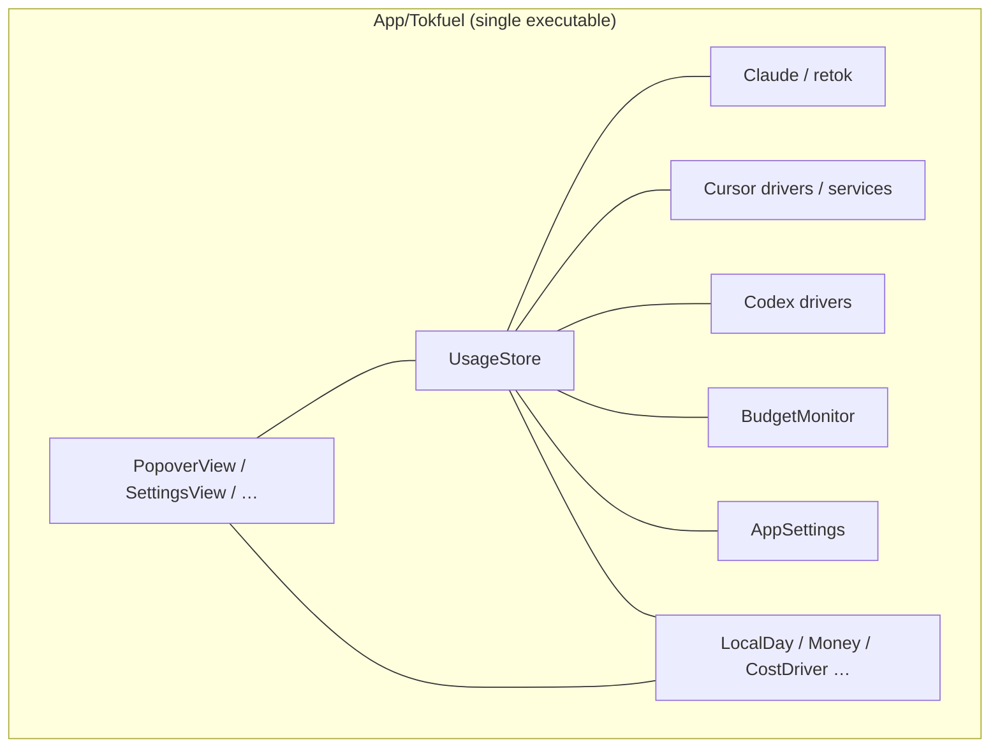
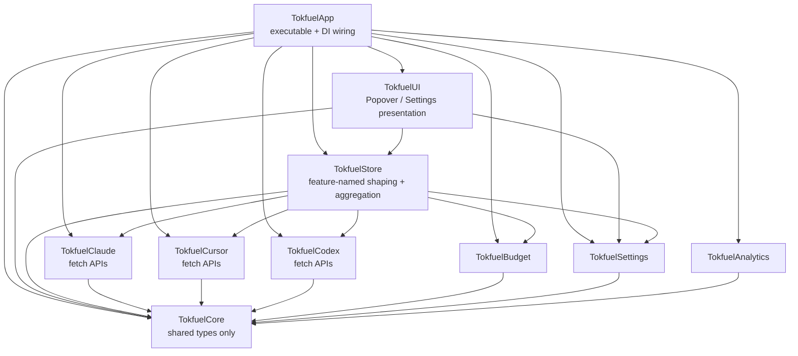
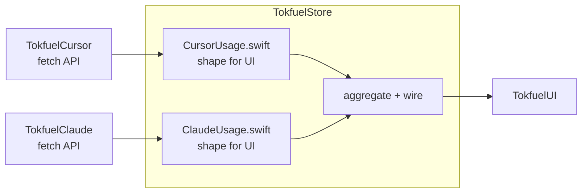

# Split SPM targets into UI / Store / sources layers

[日本語](./0002-layer-spm-modules.ja.md)

## Decision

> What was decided about the architecture or solution

### Decision

Stop using a single SPM target under `App/`. Split library targets **by layer**. Fix the data flow as follows:

```text
sources (Claude / Cursor / Codex / …)  … fetch logic; expose APIs that yield data
        ↓
Store                                  … reshape per feature-named files; aggregate for UI
        ↓
UI                                     … render what Store provides
```

- Dependency direction is **UI → Store → sources**. The App executable wires concrete types
- Split sources by fetch axis (for example Claude / Cursor / Codex / Budget). Keep only cross-cutting types in a thin `TokfuelCore` (names fixed at implementation time)
- In Store, keep source-specific shaping in **feature-named files** (for example `CursorUsage.swift` / `ClaudeUsage.swift`) and assemble what UI consumes
- UI sees Store (and thin display types) only. It does not talk to SQLite, retok, or dashboard APIs directly
- Keep Firebase, retok resources, and sqlite3 inside the source / Analytics targets that use them
- Do not change product behavior or the ground rules (local-only data, zero setup, unmodified retok, optional python3, no new packages)

The parent layout stays under `App/` per ADR-0001. This decision is about **target / module boundaries**, not about rehoming the top-level tree again.

Do not adopt feature-vertical splits that close UI pieces inside each source. The natural cut is fetch → shape → present. Splitting Claude / Cursor under sources is the lower layer only; UI and Store stay layered, not source-vertical.

### Diagrams

Today (single target, flat tree):



Adopted layers (arrows are import direction):



Inside Store (feature-named files within the layer):



`Tokfuel*` names may be finalized at implementation time.

### Examples

**Example 1: Fix today’s Cursor cost**

| Layer | What you touch |
|-------|----------------|
| `TokfuelCursor` | Fetch side (dashboard / local reads) |
| `TokfuelStore` `CursorUsage.swift`-like file | Numbers / labels shaped for UI |
| `TokfuelUI` | Row chrome only; do not touch fetch or aggregation math |

**Example 2: Adjust popover spacing / shared layout in one pass**

| Layer | What you touch |
|-------|----------------|
| `TokfuelUI` | Frame, spacing, shared components — the point of a UI layer |
| Store / sources | Leave alone when data does not change |

**Example 3: Data path for a Cursor row**

1. `TokfuelCursor` fetches from API / DB  
2. Store’s Cursor file shapes UI-facing values  
3. `UsageStore`-like aggregation sums with other sources and hands off to UI  
4. `PopoverView`-like code renders  

Do not use a micro-VC style that closes Cursor views inside `TokfuelCursor`. Presentation stays in the UI layer so cross-cutting UI edits remain possible.

### Summary of alternatives

Because the data flow is fetch → shape → present, align SPM boundaries to the same layers. Feature-vertical splits (closing UI inside each source) fight “edit UI in one pass.” Splitting Claude / Cursor under sources is lower-layer partitioning and is part of the adopted option. Extreme fine layering is too heavy at this size.

## Context

> Background, problem, and goal for this decision

### Background

App code still lives flat under `App/Tokfuel/` with a single executable target in `Package.swift` (ADR-0001 only aligned the parent under `App/`). UI, store, networking, and cost logic share one directory and one target (#109).

We also compared feature-vertical splits aimed at parallel-PR collisions. The real data path is “sources fetch, Store shapes per feature for UI,” and cross-cutting UI edits remain. Matching that cut makes the boundary a layer split.

### Problems

1. **Boundaries by convention only**
   - Store / UI / driver roles depend on docs, not the compiler.
2. **Hard to scope a change**
   - Fetch vs shape vs present is not obvious from directory names.
3. **UI cross-cuts mix with source-specific work**
   - In a flat tree, chrome edits and Cursor fetch fixes intersect easily.
4. **Need room to grow**
   - Each new source makes placement of fetch and shaping fuzzier while coupling stays high.

### Goals

- Fix dependency direction as UI → Store → sources
- Make fetch / shape / present easier to scope by layer
- Keep cross-cutting UI edits inside the UI layer
- Split sources by fetch axis; shape inside Store via feature-named files
- Keep `swift test` / `swift build -c release` green at each step

## Consideration

> Alternatives that were considered

### Options

| Option | Solution | Overview |
|--------|----------|----------|
| 1 | **Status quo** | Keep one target and a flat tree |
| 2 | **Layers** | UI / Store / sources / Core; sources split by fetch axis; Store uses feature-named files |
| 3 | **Feature vertical** | Close UI pieces inside Claude / Cursor; no layer targets |
| 4 | **Many fine layers** | Split Interface / Data (and more) inside each feature |
| 5 | **Hybrid (vertical + layer SPM)** | Feature-owned UI plus SPM layer edges |

### Comparison

| Criterion | 1 Status quo | 2 Layers | 3 Feature vertical | 4 Fine layers | 5 Hybrid |
|-----------|--------------|----------|--------------------|---------------|----------|
| Match data flow | × Mixed | ◎ Fetch → shape → present | △ UI scatters into sources | ◎ Even finer | △ Vertical and layers double up |
| Cross-cutting UI edits | × Huge files | ◎ Stay in UI layer | × Pieces scatter per feature | ○ Heavy | △ Shared UI vs feature UI split |
| Source-specific fetch edits | × Same tree | ○ Split via source targets | ◎ Closed in feature | ○ | ◎ |
| Enforce dependency direction | × Docs only | ◎ UI→Store→sources | △ Features can remix layers | ◎ | ◎ |
| Migration cost | ◎ No change | ○ Medium | ○ Medium | × Too large | △ Heavier than 2/3 |
| Fit for Tokfuel | △ Does not scale | ◎ Matches flow and UI cross-cuts | △ Weak for “edit UI together” | × SDK-oriented | △ Dual bookkeeping |

### Overall

| Option | Assessment | Verdict |
|--------|------------|---------|
| 1: Status quo | Boundaries and clarity remain weak | **Rejected** |
| 2: Layers | Matches data flow and UI cross-cuts; sources split below | **Accepted** |
| 3: Feature vertical | Helps source collisions; fights bundled UI edits | **Rejected** |
| 4: Fine layers | Cleanliness does not justify cost | **Rejected** |
| 5: Hybrid | Tries both axes; boundaries become dual | **Rejected** |

## Consequences

> Expected effects on the system and project

### Expected benefits

1. Illegal edges (UI talking to SQLite or retok internals) fail at compile time
2. Change scope is easier to explain: fetch in Cursor target, shape in Store’s Cursor file, chrome in UI
3. Cross-cutting UI work (spacing, shared components) gathers in the UI layer

### Risks and mitigations

| Risk | Detail | Mitigation |
|------|--------|------------|
| Store / UI hotspots | Shaping and screens remain layered, so unrelated PRs can still meet | Split Store by feature-named files; split UI by screen; keep PRs small |
| Store bloat | All source shaping lands in Store | Add a Store file per new source; reopen an ADR if it grows too large |
| Remaining inverted deps | For example BudgetMonitor → UI, AppSettings → drivers | Untangle with callbacks / protocols before cutting targets |
| Resource moves | `Bundle.module` for retok or Firebase plist can break | Move with Claude / Analytics targets; verify with `swift test` and runtime checks |
| Huge migration | One big change is hard to review | Order: Core → Settings → sources → Store → UI → App; split PRs if needed |

## References

> Related links

- Issue: [#109](https://github.com/Tokfuel/Tokfuel/issues/109)
- PR: https://github.com/Tokfuel/Tokfuel/pull/148
- Related ADR: [0001-app-tree](../0001-app-tree/0001-app-tree.md) (`App/` layout; prerequisite)
- External: (none)
