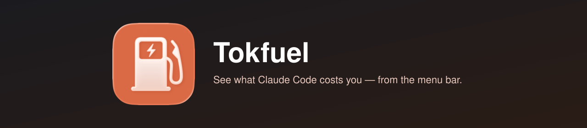
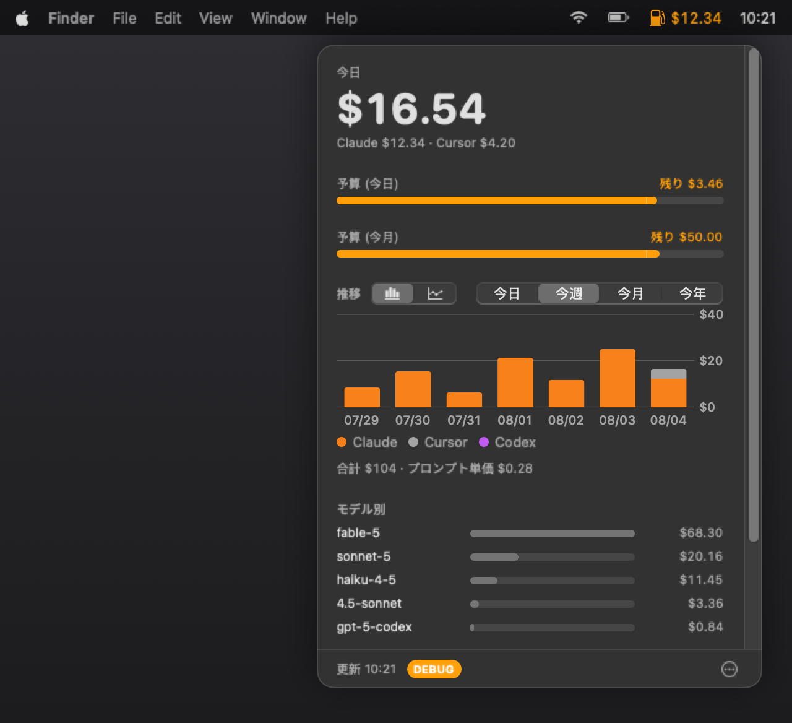

<p align="center">
  
</p>

<h1 align="center">Tokfuel</h1>

<p align="center">
  <strong>AI コーディングのコストをメニューバーから一目で。</strong>
</p>

<p align="center">
  macOS 向けの軽量な SwiftUI メニューバーアプリ（⛽️）です。<br/>
  Claude Code が <code>~/.claude/projects/</code> に書き出すトランスクリプトを読み、<br/>
  今日・期間のコストを表示します。セットアップ不要 — すべて Mac の中で完結します。
</p>

<p align="center">
  
  <a href="https://github.com/akidon0000/Tokfuel/actions/workflows/ci.yml"></a>
  <a href="https://github.com/akidon0000/Tokfuel/releases"></a>
</p>

<p align="center">
  <a href="README.md">English</a> ·
  <a href="README.ja.md">日本語</a>
</p>

---

<p align="center">
  
</p>

## 特長

- 💵 **コストが一目で**

  今日・期間のコスト、日次グラフ、モデル別内訳、高コストセッション、retok の節約ヒント。

- 🖱️ **Cursor も**

  Cursor がインストールされていてログイン済みなら、Cursor 自身のダッシュボード API から
  今日の使用量を取り、同じ合計とグラフに含めます（Cursor がディスクに持つセッションを
  使うだけで、トークンの手貼りは不要です）。オフラインや未ログインのときはローカルの
  トークンスナップショットに落ちます（Cursor 3.x では下限推定になりがちです）。
  フォールバック用の価格表は公式公開表から 1 日 1 回更新します。
  設定で合算 / Claude のみ / Cursor のみ / 並べて表示を選べます（Cost タブとメニューバーの
  両方に効き、予算ゲージは含めた側の合算のままです）。

- 🚨 **予算**

  月と 1 日の上限を独立に設定。
  上限が近づくと ⛽️ アイコンがオレンジ、超過で赤になり通知します。

- 📊 **メニューバー表示**

  見る指標（今日、今月、両方、プロンプト数）と見せ方（金額、パーセント、リング、
  リング + パーセント、アイコンのみ）を組み合わせて選べます。「予算までの残り」も選択できます。
  パーセントとゲージの分母は、予算上限か過去 30 日の日次平均です。
  ゲージの形はリング（⛽️ アイコンと並べる／置き換える）か、⛽️ アイコン自身が下から
  塗り上がるタンクから選べます。予算内は青、しきい値でオレンジ、超過で赤になり、
  今日と今月は別々に色が変わります。設定にプレビュー付き。

- 💱 **ドル / 日本円**

  予算入力を含む全金額の通貨を切り替え。
  レートは [Frankfurter](https://frankfurter.dev) から 1 日 1 回取得します。

- 🔒 **ローカルファースト**

  テレメトリなし。通信するのは為替レート取得（オプトイン）、Cursor 導入時の価格表の
  1 日 1 回の更新、そして Cursor ログイン時のダッシュボード使用量照会（認証と日付範囲
  のみ。プロンプト本文は送りません）です。
  詳細は[プライバシーポリシー](docs/PRIVACY.ja.md)と[利用規約](docs/TERMS.ja.md)へ。

## インストール

1. [Releases](https://github.com/akidon0000/Tokfuel/releases) から `Tokfuel-x.y.z.zip` をダウンロード。
2. 展開して `Tokfuel.app` を `/Applications` へドラッグ。
3. 初回起動はアプリを右クリック →**開く**
   （または**システム設定 → プライバシーとセキュリティ**で許可）。

> [!NOTE]
> 警告が出るのはアドホック署名のためです。
> ブラウザではなく `curl` でダウンロードすると警告自体が出ません。

**動作環境**

- macOS 14 以降
- コスト分析に `python3`（Xcode Command Line Tools に同梱）

**ソースからビルド**

```bash
git clone https://github.com/akidon0000/Tokfuel.git
cd Tokfuel
bash scripts/build.sh
```

## コントリビュート

PR 歓迎です — [CONTRIBUTING.md](CONTRIBUTING.md) を参照してください。

- テスト: `swift test`
- ロードマップ: [GitHub Issues](https://github.com/Tokfuel/Tokfuel/issues)
- 脆弱性を見つけたときは非公開で報告してください。[SECURITY.ja.md](SECURITY.ja.md) を参照。

<<<<<<< HEAD
## リリース手順（メンテナ向け）

`vX.Y.Z` のタグを push するか、Actions タブから **Release** ワークフローにバージョンを
入力して実行します。CI がテスト、ユニバーサルビルド、リリースノート自動生成付きの
GitHub Release 作成まで行います。

```bash
git tag v0.0.4 && git push origin v0.0.4
```

**App Store 提出（オプトイン）**：同じワークフローが、サンドボックス化した `.pkg` のビルドと
App Store Connect へのアップロード、審査提出までを fastlane で行えます。リポジトリ変数
`APPSTORE_RELEASE_ENABLED` を `true` に設定し、次の secrets を登録するまで、この job は
スキップされます。

| Secret | 内容 |
| --- | --- |
| `ASC_KEY_ID`、`ASC_ISSUER_ID`、`ASC_KEY_P8_BASE64` | App Store Connect API キー（App Manager 権限）。`.p8` は base64 で登録する |
| `MAS_CERT_P12_BASE64`、`MAS_CERT_PASSWORD` | **Apple Distribution** と **Mac Installer Distribution** の両証明書を入れた 1 つの `.p12` |
| `MAS_PROVISIONING_PROFILE_BASE64` | `com.akidon0000.tokfuel` の Mac App Store 用プロビジョニングプロファイル |
| `TOKFUEL_TEAM_ID` | Developer Portal のチーム ID（署名用 entitlements に刻印する） |

初回のみ、App Store Connect に `com.akidon0000.tokfuel` の app record を手動で作成しておく
必要があります。

> [!NOTE]
> 同梱の python3 パイプラインを Swift ネイティブに置き換える
> [#5](https://github.com/Tokfuel/Tokfuel/issues/5) が完了するまで、サンドボックス化した
> ビルドは審査を通りません。パイプラインだけを先に整備しています。

証明書なしでパッケージングだけをローカル検証するには次を実行します。

```bash
TOKFUEL_SKIP_SIGNING=1 bash scripts/package_mas.sh
```
=======
### コントリビューター

<div id="contributors">
<!-- readme: contributors -start -->
<table>
	<tbody>
		<tr>
            <td align="center">
                <a href="https://github.com/akidon0000">
                    
                    <br />
                    <sub><b>akidon0000</b></sub>
                </a>
            </td>
		</tr>
	</tbody>
</table>
<!-- readme: contributors -end -->
</div>
>>>>>>> origin/main

## 謝辞

- **コスト分析** — [retok](https://github.com/d-date/retok) を無改変で同梱。
  © [Daiki Matsudate (@d-date)](https://github.com/d-date)、[MIT License](Tokfuel/Sources/Resources/LICENSE-retok)。
- **アプリアイコン** — [Icon Composer](https://developer.apple.com/documentation/xcode/creating-your-app-icon-using-icon-composer) でデザイン。
  ソースドキュメントは [Tokfuel/icon](https://github.com/Tokfuel/icon) にあります。
- **為替レート** — [Frankfurter](https://frankfurter.dev)。
- **ロードマップ規約** — [bajutsu](https://github.com/bajutsu-e2e/bajutsu) の Issue 駆動開発ワークフローを参考に設計。

## ライセンス

[MIT](LICENSE) © [Dan Akiyama (@akidon0000)](https://github.com/akidon0000)
