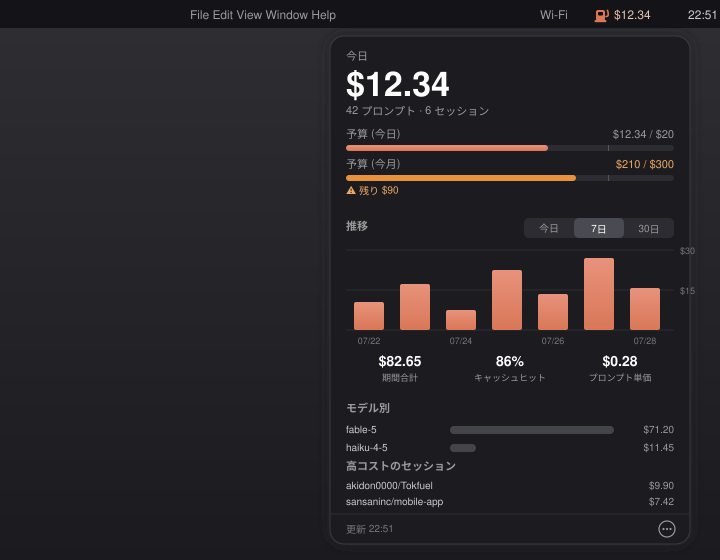

<p align="center">
  
</p>

<h1 align="center">Tokfuel</h1>

<p align="center">
  <strong>See how you actually use Claude Code — from the menu bar.</strong><br/>
  A tiny, native SwiftUI menu-bar app that reads your local Claude Code usage logs and shows skill, MCP, sub-agent, and prompt counts at a glance.
</p>

<p align="center">
  
  
  
  
  
  <a href="https://github.com/akidon0000/tokfuel/actions/workflows/ci.yml"></a>
</p>

<p align="center">
  <a href="README.md">English</a> ·
  <a href="README.ja.md">日本語</a>
</p>

---

<p align="center">
  
</p>

## ✨ Why?

Claude Code quietly accumulates a lot of usage signal — how much each session costs, which skills you lean on, which MCP servers you hit, how often you reach for sub-agents — but that data just sits in transcript files under `~/.claude/projects/`. **Tokfuel** surfaces all of it with **zero setup**: install the app and it reads the transcripts directly. No hooks, no CLI install, no servers, no telemetry — everything stays on your Mac.

Cost analysis is powered by a bundled copy of [retok](https://github.com/d-date/retok) by [Daiki Matsudate (@d-date)](https://github.com/d-date) — a token-efficiency analyzer for Claude Code logs (MIT License, see [Acknowledgements](#-acknowledgements--third-party-licenses)).

## 🚀 Features

- 💵 **Cost tab (via retok)** — today's / period cost in the menu bar and popover, cache-hit rate, cost per prompt, daily cost chart, per-model breakdown, most expensive sessions, and retok's actionable recommendations (cache TTL misses, oversized contexts, retry loops, …).
- 🛠 **Tools tab** — daily Skills / MCP / sub-agent activity chart, most-used rankings, grouped by genre and per-repo breakdowns.
- 🧹 **Skills tab** — inventory of every installed skill (global / plugin / project) cross-referenced with actual usage, so unused skills stand out as removal candidates. **Click any row to reveal its folder in Finder** and decide for yourself — the app never deletes anything.
- ⚙️ **Zero setup** — scans `~/.claude/projects/` transcripts directly (with an incremental cache) and registers itself as a login item. Install and forget.
- 🛠️ **Settings** — a gear button opens a settings window: launch-at-login, menu-bar display (cost / prompt count / icon only), default period, report language, and **scan locations** (Claude directory & repository root) so it works on any machine layout, not just `~/.claude` + `~/ghq`.
- 🚨 **Budget alerts** — set a spending limit (USD) per period (rolling 30 days or calendar month). At a configurable threshold (70/80/90%) the menu-bar icon turns orange and a notification fires; over the limit it turns red. The Cost tab shows a budget progress bar with the threshold marker.
- 📊 **Menu-bar resident** — shows today's estimated cost right in the menu bar, no Dock clutter (`LSUIElement = YES`), auto-refreshes every 10 minutes.
- 📏 **Server-truth limits (opt-in)** — a Settings toggle (off by default) shows the *same* 5-hour / weekly usage percentages as the official `/usage` command, with reset countdowns and your plan badge (plan detection itself is local-only). It reuses the OAuth token Claude Code already stores (file or Keychain) and sends **only that token, only to Anthropic**. A second, independent toggle does the same for **Codex** (`~/.codex/auth.json` token → OpenAI only), showing Codex's 5-hour / weekly percentages and plan. These opt-ins are the app's only network features; everything else stays fully offline, and tokens are never refreshed by the app (open the respective CLI if expired). Technique credit: [CodexBar](https://github.com/steipete/CodexBar) (MIT).
- 🤝 **Provider comparison** — if you also use OpenAI Codex CLI, a "Providers" section on the Tools tab compares session counts (share bar) and Codex token usage side by side with Claude Code, read directly from `~/.codex/sessions/` rollout logs. Local files only — no OAuth, no CLI invocation; the section simply doesn't appear on machines without Codex.
- 🪞 **Self-instrumentation** — Tokfuel records its *own* UI events (popover opens, tab switches, setting changes — never transcript content, project names, or costs) to a local JSONL under `~/Library/Application Support/Tokfuel/events/`, as evidence for future improvement decisions. On by default because it never leaves the Mac; Settings can view, disable, or erase it.
- 🔒 **100% local** — nothing leaves your machine.

## 🧰 Requirements

- macOS **14.0** Sonoma or later
- Xcode **16+** / Swift **6.0** toolchain (to build)
- `python3` (ships with Xcode Command Line Tools) — used to run the bundled retok for the Cost tab; the Tools / Skills tabs work without it

## 📦 Install

### Option 1: Build & install with the script (recommended)

```bash
git clone https://github.com/akidon0000/tokfuel.git
cd tokfuel

./build.sh
```

`build.sh` runs a release build, packages a `Tokfuel.app` bundle into `/Applications`, ad-hoc signs it, and launches it.

### Option 2: Run from source

```bash
swift run -c release
```

> [!NOTE]
> The app is **ad-hoc signed** (`codesign --sign -`). On first launch macOS may warn that the developer can't be verified — right-click the app and choose **Open**, or allow it in **System Settings → Privacy & Security**.

## 🖱 Usage

1. The menu bar shows **today's estimated cost** at all times; click the icon to open the popover.
2. **Cost** — period totals (Today / 7d / 30d), cache-hit rate, daily cost chart, per-model costs, retok recommendations (tap to expand), and the most expensive sessions.
3. **Tools** — a period filter (Today / 7d / 30d / All), today's counts with day-over-day deltas, a stacked daily chart of Skills / MCP / Agents, most-used rankings, and genre → repo drill-down. A persistent "Today" line under the header shows today's cost, prompts, and sessions on every tab, and the last-selected periods are remembered.
4. **Skills** — installed-skill inventory; unused skills are flagged red. Click any row to open its folder in Finder.
5. Hit **↻** to rescan, **⚙** for settings, or **⊗** to quit. Data auto-refreshes every 10 minutes anyway.

## 🗂 Data source

Everything is derived from the transcripts Claude Code already writes — no hooks or extra configuration:

```
~/.claude/projects/
└── <project-dir>/
    └── <session>.jsonl   # scanned for tool_use (Skill / mcp__* / Agent) and prompts
```

- The Swift scanner counts Skill / MCP / sub-agent calls and prompts per repo per day, with a per-file incremental cache in `~/Library/Application Support/Tokfuel/` so rescans are fast.
- The bundled [retok](https://github.com/d-date/retok) script analyzes the same transcripts for token usage, cost estimates, cache efficiency, and recommendations (`retok --json`).
- The **Claude directory** (`~/.claude`) and **repository root** (`~/ghq`, searched up to 3 levels deep for `.claude/skills`) are both configurable in Settings, so non-ghq layouts work too.

## 🏗 Architecture

```
Tokfuel/Sources/
├── App.swift                # @main, AppDelegate, NSStatusItem + NSPopover, login item, refresh timer
├── PopoverView.swift        # SwiftUI popover: Cost / Tools / Skills tabs
├── UsageStore.swift         # ObservableObject: aggregates scanner + retok results
├── TranscriptScanner.swift  # scans ~/.claude/projects JSONL for tool usage (incremental cache)
├── RetokService.swift       # runs the bundled retok via python3, decodes the JSON report
├── AppSettings.swift        # UserDefaults-backed settings (login item, display, period, language)
├── SettingsView.swift       # SwiftUI settings window
└── Resources/
    ├── retok.py             # vendored, unmodified copy of d-date/retok (© Daiki Matsudate, MIT)
    ├── locales/             # retok translations (recommendations follow your locale)
    ├── LICENSE-retok        # retok's MIT license text (ships inside the app)
    └── README-retok.md      # provenance: upstream repo, vendored commit, update procedure
```

- `UsageStore` is the single source of truth: it merges the transcript scan and the retok report and publishes them.
- `PopoverView` is pure presentation, driven by the store.
- `AppDelegate` owns the status item and popover lifecycle; the app runs as an accessory (no Dock icon) and registers itself as a login item.

## 🤝 Contributing

PRs welcome! See [CONTRIBUTING.md](CONTRIBUTING.md) for dev setup, coding style, and the PR checklist.

Planned and shipped features are tracked as **CU items** in [`roadmaps/`](roadmaps/README.md)
(bilingual, Swift-Evolution-style proposals — a convention adapted from
[bajutsu](https://github.com/bajutsu-e2e/bajutsu)). The Proposals table and "Unsorted ideas" there
are the up-to-date backlog; a few starters:

- A time-range filter (today / this week / all time).
- Edit-metrics (added / deleted lines) visualization — the data is already decoded.
- [CU-0002](roadmaps/CU-0002-native-swift-cost-analysis/CU-0002-native-swift-cost-analysis.md) — native Swift cost analysis (drops the python3 dependency).

## 🙏 Acknowledgements / Third-party licenses

This app bundles **[retok](https://github.com/d-date/retok)** — © [Daiki Matsudate (@d-date)](https://github.com/d-date), released under the [MIT License](Tokfuel/Sources/Resources/LICENSE-retok). The vendored copy is unmodified (only the filename differs: `retok` → `retok.py`); its license text ships inside the app bundle, and provenance (upstream commit, update procedure) is documented in [README-retok.md](Tokfuel/Sources/Resources/README-retok.md). All cost estimation, cache-efficiency analysis, and recommendations in the Cost tab are retok's work.

## 📄 License

[MIT](LICENSE) © akidon0000 — except the bundled retok (see above).
