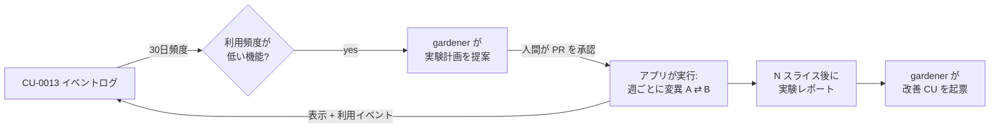

[English](CU-0014-self-experiments.md) · **日本語**

# CU-0014 — 低頻度機能へのタイムスライス自己実験

<!-- CU-METADATA -->
| 項目 | 値 |
|---|---|
| 提案 | [CU-0014](CU-0014-self-experiments-ja.md) |
| 提案者 | [@akidon0000](https://github.com/akidon0000) |
| 状態 | **提案** |
| トピック | 洞察と実験 |
<!-- /CU-METADATA -->

## はじめに

ユーザーが 1 人のアプリのための軽量な実験フレームワークです。機能の利用頻度が低いと分かった
とき（[CU-0013](../CU-0013-local-feature-instrumentation/CU-0013-local-feature-instrumentation-ja.md)
で計測）、UI の変異案を*期間で交互に切り替えて*試し（例: A の週 / B の週）、変異ごとの表示と
利用をログに取り、どちらがより使われたかを報告します。

## 動機

要望は「利用頻度が低い機能に自動で A/B テスト」でした。古典的な A/B はユーザーを群に割り
当てますが、ユーザーが 1 人では成立しません。被験者内実験に読み替えたのがタイムスライス
です。同じユーザーがある期間は変異 A と、次の期間は変異 B と暮らし、それを繰り返して、
アクティブだった変異ごとの利用量を比べます。n=1 のシグナルであることに正直でありつつ、勘
よりは確かで、ロードマップの自動起票（[CU-0015](../CU-0015-roadmap-gardener/CU-0015-roadmap-gardener-ja.md)）
が改善提案を書くための証拠になります。

## 詳細設計

- **計画ファイル**: `~/Library/Application Support/Tokfuel/experiments.json` — 計画の配列
  `{id, hypothesis, flagKey, variants:[control,treatment], sliceDays（既定 7）,
  slices（既定 4）, metricEvents, startedAt}`。人間が編集できる形式で、gardener が計画を
  提案し、人間が導入します（v1 は PR からコピー。設定画面のインポーターは後続で）。
- **ランナー**: 更新のたびに `ExperimentRunner` が `(now - startedAt) / sliceDays` の偶奇
  からアクティブな変異を決め、UI が読むフィーチャーフラグ（`AppSettings` に置く）として
  公開し、`experiment_exposure` を記録します。スライスを使い切った実験は control に固定
  され、終了として扱われます。
- **指標**: 利用量 = スライスごとの計画の `metricEvents` 件数（CU-0013 から）に、その時
  アクティブだった変異のタグを付けたもの。統計検定の芝居はしません。レポートはスライス別
  件数と素朴な比率を示し、n=1 のタイムスライス信号だと明記します。
- **レポート**: 計画の隣に `experiments/<id>-report.json`。設定画面の「Experiments」カード
  に実行中 / 終了の実験と件数を表示します。
- **安全柵**: 変異が変えてよいのは表示の既定値だけです（タブ順・セクションの表示 / 非表示・
  文言・既定の期間）。予算・通知しきい値・スキャン範囲は決して変えません。実験は常に設定
  画面から見え、そこから即座に停止できます。

## 検討した代替案

**ユーザー横断の古典的 A/B。** n=1 で不可能なうえ、テレメトリの外部送信が要るため二重に
不採用です。

**人間のゲートなしで実験を全自動開始。** 不採用。アプリが黙って自分の UI を変えると信頼を
損ないます。gardener は*提案*し、人間が導入する。ゲートはレビュー 1 回です。

## 進捗

- [ ] TBD — 計画スキーマ + `ExperimentRunner` + ユニットテスト（スライスの偶奇・固定化）、
  `AppSettings` のフラグ配線、表示 / 指標の記録、設定カード、レポート出力。

## 参考

- [CU-0013](../CU-0013-local-feature-instrumentation/CU-0013-local-feature-instrumentation-ja.md) — 計測に使うイベントログ。
- [CU-0015](../CU-0015-roadmap-gardener/CU-0015-roadmap-gardener-ja.md) — 計画の提案とレポートの消費者。
- `Tokfuel/Sources/AppSettings.swift` — 変異フラグの置き場所。
