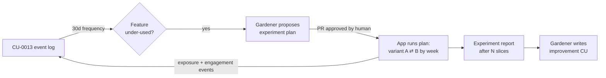

**English** · [日本語](CU-0014-self-experiments-ja.md)

# CU-0014 — Time-sliced self-experiments on low-use features

<!-- CU-METADATA -->
| Field | Value |
|---|---|
| Proposal | [CU-0014](CU-0014-self-experiments.md) |
| Author | [@akidon0000](https://github.com/akidon0000) |
| Status | **Proposal** |
| Topic | Insights & experiments |
<!-- /CU-METADATA -->

## Introduction

A lightweight experiment framework for a one-user app: when a feature's usage is low
(measured by [CU-0013](../CU-0013-local-feature-instrumentation/CU-0013-local-feature-instrumentation.md)),
try a UI variant by *alternating variants over time slices* (e.g. week A / week B), log
exposures and engagement per variant, and report which variant got used more.

## Motivation

The user asked for "automatic A/B tests on low-usage features". Classic A/B assigns users to
arms — impossible with one user. The within-subject equivalent is time slicing: the same user
lives with variant A for a period, variant B for the next, repeated; engagement per active
variant is compared. It is honest about being an n=1 signal, but it beats guessing, and it
gives the roadmap gardener ([CU-0015](../CU-0015-roadmap-gardener/CU-0015-roadmap-gardener.md))
evidence to write improvement proposals from.

## Detailed design

- **Plan file**: `~/Library/Application Support/Tokfuel/experiments.json` — an array of
  plans: `{id, hypothesis, flagKey, variants:[control,treatment], sliceDays (default 7),
  slices (default 4), metricEvents, startedAt}`. Human-editable; the gardener proposes plans,
  the human installs them (v1: copy from the PR; a Settings importer can follow).
- **Runner**: on refresh, `ExperimentRunner` computes the active variant from
  `(now - startedAt) / sliceDays` parity, exposes it as a feature flag the UI reads (flags
  live in `AppSettings`), and logs `experiment_exposure`. When slices are exhausted the
  experiment freezes to control and is marked finished.
- **Metrics**: engagement = count of the plan's `metricEvents` (from CU-0013) during each
  slice, tagged by active variant. No stats-test theater — the report shows per-slice counts
  and a plain ratio, labeled as an n=1 time-sliced signal.
- **Report**: `experiments/<id>-report.json` next to the plan; a compact "Experiments" card
  in Settings shows running/finished experiments and their counts.
- **Safety rails**: variants may only change presentation defaults (tab order, section
  visibility, copy, default period) — never budgets, notifications thresholds, or scan
  scope. An experiment is always visible in Settings and can be stopped there instantly.

## Alternatives considered

**Classic A/B across users.** Impossible (n=1) and would require telemetry leaving the Mac —
doubly rejected.

**Fully automatic experiment start (no human gate).** Rejected — the app silently changing
its own UI erodes trust. The gardener *proposes*; a human installs. The gate is one review.

## Progress

- [ ] TBD — plan schema + `ExperimentRunner` + unit tests (slice parity, freeze), flag
  plumbing in `AppSettings`, exposure/metric logging, Settings card, report writer.

## References

- [CU-0013](../CU-0013-local-feature-instrumentation/CU-0013-local-feature-instrumentation.md) — the event log this measures with.
- [CU-0015](../CU-0015-roadmap-gardener/CU-0015-roadmap-gardener.md) — proposes plans and consumes reports.
- `Tokfuel/Sources/AppSettings.swift` — where the variant flags live.
