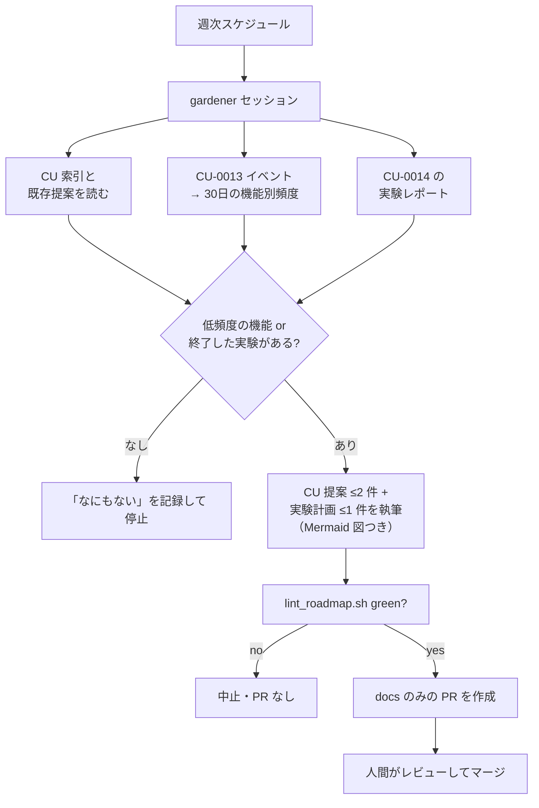

[English](CU-0015-roadmap-gardener.md) · **日本語**

# CU-0015 — roadmap gardener: 証拠駆動の定期自動起票

<!-- CU-METADATA -->
| 項目 | 値 |
|---|---|
| 提案 | [CU-0015](CU-0015-roadmap-gardener-ja.md) |
| 提案者 | [@akidon0000](https://github.com/akidon0000) |
| 状態 | **提案** |
| トピック | ワークフローと自動化 |
<!-- /CU-METADATA -->

## はじめに

週 1 回、ローカルで動く Claude Code のスケジュールセッションです（データがローカルにある
ため、実行場所もローカルです）。Tokfuel 自身の利用イベント（[CU-0013](../CU-0013-local-feature-instrumentation/CU-0013-local-feature-instrumentation-ja.md)）
と終了した実験のレポート（[CU-0014](../CU-0014-self-experiments/CU-0014-self-experiments-ja.md)）
を読み、利用頻度の低い機能を見つけて、ロードマップへの出力を PR として起票します。中身は
改善 CU 提案（現状フローと提案フローの Mermaid 図つき）と実験計画で、人間のレビューなしには
何も取り込まれません。

## 動機

いまのロードマップは、セッションに頼んだときにしか育ちません。一方でアプリは、良い提案に
必要な証拠 — 機能別の利用頻度と実験の結果 — をちょうど生み出すようになります。柵をきちんと
立てた小さなループがその証拠を定期的にレビュー可能な提案へ変換すれば、バックログは記憶では
なく観測された行動を反映します。図を必須にするのは、レビュアーは散文よりフローの絵のほうが
速く判断できるからです（GitHub は Mermaid をそのまま描画します）。

## 詳細設計

アプリのコードではなく、リポジトリのスキル（`.claude/skills/roadmap-gardener/`）+ 週次の
スケジュールタスクとして実装します。ループの柵は先に決めておきます。

- **起動と予算**: 週 1 回・1 セッション。**1 回の実行で新規 CU 提案は 2 件まで・実験計画は
  1 件まで**の固定上限。低頻度の機能も終了した実験もなければ、ジャーナルに 1 行書いて停止
  します（空振りは成功です）。
- **証拠ルール**: すべての提案は数字を引用します — 「Tools タブ: 30 日で 3 回 open（ポップ
  オーバー open は 41 回）」のように CU-0013 の集計から。実験由来の提案はレポートを引用
  します。証拠のない提案は書きません。
- **図ルール**: 生成する提案は必ず Mermaid 図（現状と提案後のインタラクションフロー）を
  1 枚以上含めます。あわせてロードマップ README に「提案には図を推奨」の一文を足します。
- **影響範囲**: 書き込みは `roadmaps/` 配下（+ ジャーナル）のみ。ブランチは
  `claude/gardener-<date>`、PR は docs のみ。アプリコードの編集・マージ・既存項目の削除は
  決して行いません。
- **検証**: PR を開く前に `bash scripts/lint_roadmap.sh` が通ること（自己採点ではない独立
  チェック）。CI が同じ lint を PR 上でも実行します。
- **重複ガード**: 先に CU 索引と open PR を読み、既存項目と重なるアイデアはその項目への
  追記（またはスキップ）にし、新しい ID を切りません。
- **状態のアンカー**: `roadmaps/.gardener/journal.md` に毎回の実行（日付・読んだ証拠・
  行動、または「なにもない」）を記録します。人間に却下された提案はここに「再提案しない」
  として残し、翌週また同じ提案をしないようにします。
- **停止条件**: 上限到達、lint が 2 回失敗、必要な入力の欠如（イベントログがまだ無い等）
  → 理由をジャーナルに書いて停止します。同じ失敗へのリトライは行いません。

## 検討した代替案

**クラウド / CI の cron。** 不採用。証拠（イベントログ・実験レポート）は原則 1 により
ローカル限定なので、ループはデータのある場所で走る必要があります。

**PR の自動マージ。** 不採用。人間のゲートこそが品質の仕組みであり、実験計画にとっては
同意の仕組みです。

**アプリ本体に組み込む。** 不採用。二言語の提案執筆はエージェントの仕事であって、メニュー
バーアプリの仕事ではありません。アプリは証拠を供給し、スキルが判断を担います。

## 進捗

- [ ] TBD — `roadmap-gardener` スキル（プロンプト + 証拠リーダー + 上限）、ジャーナル形式、
  週次スケジュールの設定、README への図の推奨の一文。CU-0013（証拠源）にブロックされ、
  実験計画の執筆は CU-0014 にもブロックされます。

## 参考

- [CU-0013](../CU-0013-local-feature-instrumentation/CU-0013-local-feature-instrumentation-ja.md)、[CU-0014](../CU-0014-self-experiments/CU-0014-self-experiments-ja.md) — 証拠の供給源。
- `scripts/lint_roadmap.sh` — 独立した検証器。
- `.claude/skills/ideation/SKILL.md` — gardener が流用する執筆規約。
