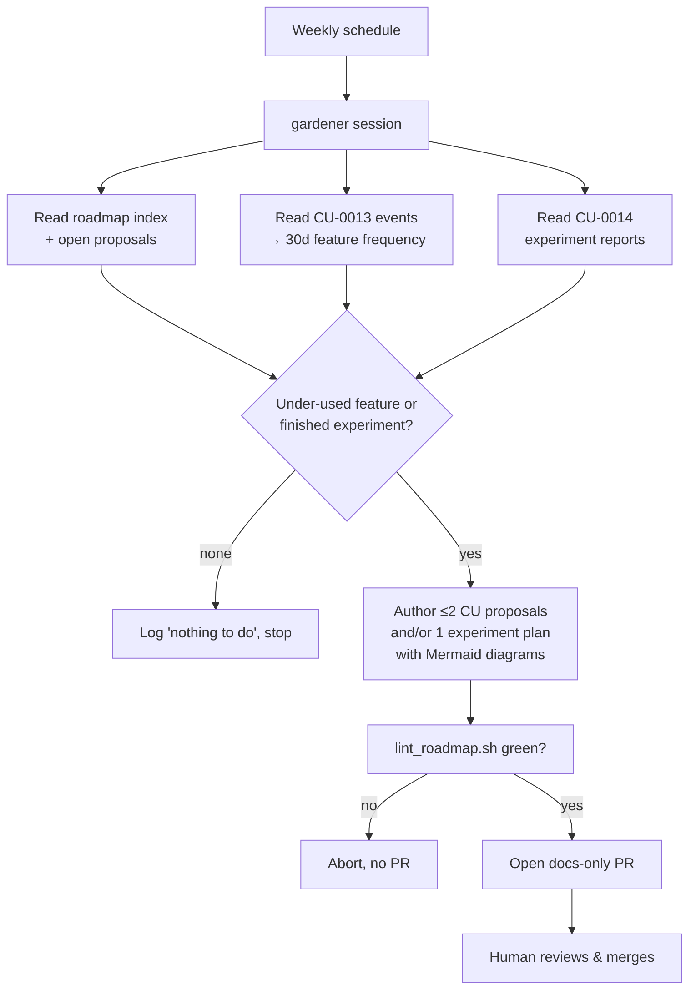

**English** · [日本語](CU-0015-roadmap-gardener-ja.md)

# CU-0015 — Roadmap gardener: scheduled, evidence-driven proposal authoring

<!-- CU-METADATA -->
| Field | Value |
|---|---|
| Proposal | [CU-0015](CU-0015-roadmap-gardener.md) |
| Author | [@akidon0000](https://github.com/akidon0000) |
| Status | **Proposal** |
| Topic | Workflow & automation |
<!-- /CU-METADATA -->

## Introduction

A scheduled Claude Code session (weekly, running locally — the data is local) that reads
Tokfuel's own usage events ([CU-0013](../CU-0013-local-feature-instrumentation/CU-0013-local-feature-instrumentation.md))
and finished experiment reports ([CU-0014](../CU-0014-self-experiments/CU-0014-self-experiments.md)),
finds under-used features, and authors roadmap output as a PR: improvement CU proposals
(each with a Mermaid diagram of current vs. proposed flow) and/or new experiment plans.
Nothing lands without human review.

## Motivation

The roadmap currently grows only when a session is asked to ideate. Meanwhile the app now
produces exactly the evidence good proposals need — usage frequencies and experiment
outcomes. A small, well-fenced loop turns that evidence into reviewable proposals on a
cadence, so the backlog reflects observed behavior instead of memory. Diagrams are mandated
because a reviewer decides on a picture of the flow faster than on prose (GitHub renders
Mermaid natively).

## Detailed design

Implemented as a repo skill (`.claude/skills/roadmap-gardener/`) invoked by a weekly
scheduled task — no app code. Loop-engineering guardrails, decided up front:

- **Trigger & budget**: once per week, one session, hard-capped: **≤ 2 new CU proposals and
  ≤ 1 experiment plan per run**. If there is nothing under-used and no finished experiment,
  it writes a one-line journal entry and stops (a null run is a success).
- **Evidence rule**: every proposal must cite its numbers — "Tools tab: 3 opens in 30 days
  vs. 41 popover opens" — from CU-0013 aggregates, and experiment-driven proposals cite the
  report. No evidence, no proposal.
- **Diagram rule**: every generated proposal embeds at least one Mermaid diagram (current vs.
  proposed interaction flow). The roadmap README gains a sentence encouraging diagrams in
  all proposals.
- **Blast radius**: writes only under `roadmaps/` (+ journal); branch `claude/gardener-<date>`;
  PR is docs-only. Never edits app code, never merges, never deletes existing items.
- **Verification**: `bash scripts/lint_roadmap.sh` must pass before the PR is opened
  (independent check, not self-grading); CI runs the same lint on the PR.
- **Duplicate guard**: reads the CU index and open PRs first; an idea overlapping an existing
  item augments that item (or is skipped) instead of minting a new ID.
- **State anchor**: `roadmaps/.gardener/journal.md` records each run (date, evidence read,
  actions, or "nothing to do") so consecutive runs don't re-propose rejected ideas; a
  human-rejected proposal is listed there as do-not-repropose.
- **Stop conditions**: caps reached, lint fails twice, or required inputs missing (no event
  log yet) → stop and journal the reason. It never retries into the same failure.

## Alternatives considered

**A cloud/CI cron.** Rejected — the evidence (event log, experiment reports) is local-only
by ground rule 1; the loop must run where the data lives.

**Auto-merge the PR.** Rejected — the human gate *is* the quality mechanism (and the consent
mechanism for experiment plans).

**Build it into the app.** Rejected — authoring bilingual proposals is an agent job, not a
menu-bar app job; the app supplies evidence, the skill supplies judgment.

## Progress

- [ ] TBD — `roadmap-gardener` skill (prompt + evidence readers + caps), journal format,
  weekly schedule setup, README convention note on diagrams. Blocked on CU-0013 (evidence
  source); experiment authoring blocked on CU-0014.

## References

- [CU-0013](../CU-0013-local-feature-instrumentation/CU-0013-local-feature-instrumentation.md), [CU-0014](../CU-0014-self-experiments/CU-0014-self-experiments.md) — the evidence sources.
- `scripts/lint_roadmap.sh` — the independent verifier.
- `.claude/skills/ideation/SKILL.md` — the authoring conventions the gardener reuses.
